절대경로
http 원격
/ 루트경로(최상위경로)

상대경로
./(생략가능)  해당폴더
../ 상위폴더

브라우저는 기본적으로
index.html을 찾는다.

부모요소
상위요소

자식요소
하위요소

빈태그

empty태그

span 
in
# 전역속성
    data-속성명  

# 일치선택자
    -> 각각의 선택자를 일치하는것(띄어쓰기 안함)

# 복합선택자
    -> 자식 선택자 
    ex) 부모선택자 '>' 자식선택자 
    ->하위 선택자(후손 부모선택자 아래에 있는 모든 하위 선택자에 해당된다.)
    띄어쓰기 진행
    ex) 부모선택자 " " 자식선택자
    -> 인접 형제 선택자
    같은 부모요소를 공유하는 선택자
    ex) 형제선택자 '+' 형제선택자
    요소 선택자의 다음 선택자의 스타일을 바꾼다.(한개만 바꿈) 
    -> 일반 형제 선택자
    ex) 형제선택자 '~' 형제선택자
    요소 선택자의 다음 선택자의 스타일을 바꾼다.
    (다음 형제 선택자 모두를 바꿈) 
       
# 가상클래스
    어떠한 행동을 했을때 변하는 클래스

    hover : 마우스 커서가 올라가 있는 동안 스타일 변한다.
    ex) abc:hover

    active : 마우스를 클릭하고 있는 동안 (마우스 때면 풀린다.)
    ex) abc:active

    focus : 포커스가 가능한 요소에서 포커스가 될때(해당 태그가 활성화 되는것 input,button...)
    포커스가 안되는 요소에사 tabindex 속성을 -1로 줄경우 강제로 포커스가 가능해진다.
    ex> abc:focus

# 가상클래스 선택자 
    first-child : 형제 요소 중 첫번째 선택
    ex) 부모클래스 형제선택자:first-child

    last-child : 형제 요소 중 마지막 선택
    ex) 부모클래스 형제선택자:last-child

    nth-child(n) : 형제 요소 중 n번째 선택
    ex) 부모클래스 형제선택자:nth-child(n)

    not(xyz) : 부정선택자 형제 요소 중 xyz요소가 아닌것
    ex) 부모클래스 형제선택자:not(xyz)

# 가상 요소 선택자
가상요소 선택자와 스타일content는 필수요소이다.
텍스트가 아니라 스타일을 추가할수도 있다.

    before : 선택자 abc 요소의 내부 앞에 내용(content)을 삽입
    가상의 인라인 요소를 만들어 선택자 앞에 내용 삽입
    ex) 선택자::before { context : String} 

    after : 선택자 abc 요소의 내부 뒤에 내용(content)을 삽입
    가상의 인라인 요소를 만들어 선택자 뒤에 내용 삽입
    ex) 선택자::after { context : String} 

# 속성 선택자
    [abc] : 속성 abc를 찾는다.
    ex) [disabled] : disabled 속성을 가진요소를 찾는다.

    [abc="xyz"] : 속성 abc를 포함하며 그 값이 xyz인 요소 선택
    ex) [type="password"] :type="password"요소를 찾는다.

# 스타일 상속
    부모에게 적용된 css가 자식에게도 그대로 적용이 된다.
    모든 css가 적용되진 않는다.
    글자/문자 관련 속성들만 적용이 된다.

    강제 상속
    부모속성의 css을 자식속성에도 상속을 하고 싶을 경우에는 해당 css에 inherit 지정한다.
    ex) .parent { backgound-color : red }
        .child {backgound-color : inherit}
    -> 부모태그의 css를 자식태그에서도 상속받아 자동으로 적용된다.

# 우선순위
    같은 요소가 여러 선언의 대상이 된 경우, 어떤 선언의 css속성을 우선 적용할지 결정하는 방법
    1. 점수가 높은 선언이 우선함
        1.태그선택자(!important)
        2.인라인선언(태그 내부에 직접적으로 선언)
        3.아이디선택자
        4.클래스선택자(가상클래스)
        5.태그선택자(가상요소선택자)
        6.전체선택자
        7.부모선택자(상속)
        0.부정선택자는 점수 계산 안함
    2. 점수있가 같으면, 가장 마지막에 해석된 선언이 우세함

# css속성

## 박스모델 (너비)
 width(가로)
 height(세로)
인라인 요소 : 가로,세로 자동으로 줄어듬
    -> 글자 제어용이기 때무네 가로,세로 지정 불가
블록 요소 : 가로 사이즈 부모 요소만큼 자동으로 늘어남, 세로 자동으로 줄어듬
max-width : 최대 크기 제한
max-height : 최대 크기 제한
min-width : 최소 크기 제한
min-height : 최소 크기 제한

## css단위
    
    px  : 픽셀
        
    %   : 상대적 백분율
        -> 부모의 요소에 대해 상대적 백분율을 가진다.
    em  : 요소의 글꼴 크기
        -> 폰트 사이즈에 따라 값이 변한다.(상속가능)
        -> 기본적 값으로 폰트 사이즈는 16px을 가진다.
    rem : 루트 요소의 글꼴 크기
        -> html 요소에 지정되어 있는 폰트 사이즈만을 기준으로 적용한다.
    vw  : 뷰포트 가로 너비의 백분율
        -> 화면의 너비 백분율
    vh  : 뷰포트 세로 너비의 백분율
        -> 화면의 너비 백분율

## 외부 여백 (마진, margin)

* 단축 속성 : 상하좌우 각각의 방향을 각각 지정하는것이 아니라 한번에 지정하면 자동 적용되는것
ex ) margin :10px; (상하좌우 모두 10px 마진을 가진다.)
     margin : 10px, 20px; (상하 10px, 좌우 20px)

    요소의 외부 여백을 지정하는 단축 속성
    음수도 적용이 가능하다.

## 내부 여백 (패딩, padding)

    요소의 내부 여백(공간)을 지정하는 단축 속성
    요소의 크기가 커진다.

## 테두리 선과 색상 (border)

    요소의 테두리 선을 지정하는 단축 속성
    요소의 크기가 커진다.(요소의 크기만큼 전체크기가 증가한다.)

    border : 선-두께(border-width), 선-종류(border-style), 선-색상(border-color)

    선-두께(border-width) : 기본값(medium)
    마진,패딩과 마찬가지로 각각의 두께를 지정할 수 있다.

    선-종류(border-style) : 기본값(none)
    선-두께와 마찬가지로 각각의 스타일을 지정할수 있다.

    선-색상(border-color) : 테두리 선의 색을 지정할 수 있다.
    선-두께와 마찬가지로 각각의 색상을 지정할 수 있다.

## 모서리 둥글게(border-radius)

    요소의 모서리를 둥글게 깍음
    기본값 : 0;

## 크기 계산 (box-sizing)

    박스의 크기는 단순히 width,heigth의 길이 뿐만아니라
    border,padding의 요소의 크기도 같이 증가하는 스타일요소들의 값도 같이 더해야 한다.

    box-sizing : border-box
    스타일을 통해 테두리, 패딩처럼 요소의 크기가 증가하는 스타일을 추가해도 전체길이가 증가 안되게 제어할수 있다.
    
    box-sizing : border-box (요소의 내용 + 패딩 + 테두리 크기로 계산)

## 넘침제어 (overflow)

    overflow 
    요소이 크기 이상으로 내용이 넘쳤을 때 보여짐을 제어하는 단축 속성
    visible : 넘친 내용을 그대로 보여줌
    hidden : 넘친 내용을 잘라냄
    auto : 넘친 내용이 있는   경우에만 잘라내고 스크롤바 생성
    
    overflow-x : x축으로만 넘칠경우
    overflow-y : y축으로만 넘칠경우

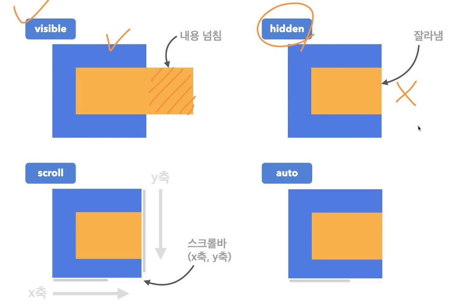
## 출력 특성(display)

    화면 출력 특성
    block : 상자
    inline : 글자
    inline-block : 글자 + 상자
    flex : 플렉스 박스 (1차원 레이아웃)
    grid : 그리드 (2차원 레이아웃)
    none : 보여짐 없음, 화면에서 사라짐

## 투명도(opacity)

    opacity
    default : 1 
    0 : 안보임
    1 : 보임(불투명)

## 글꼴
 
    font-style : 글자의 기울기
        normal : 기울기 없음
        italic : 이텔릭체

    font-weight : 글자의 두께
        normal, 400 : 기본값
        bold, 700 : 두껍게
        bolder : 상위 요소보다 두껍게(상대적)
        ligher : 상위 요소보다 얇게(상대적)
        100 ~ 900 : 100단위 숫자 9개

    font-size
        16px :기본값

    line-height :한 줄의 높아, 행간과 유사
        숫자 : 요소의 글꼴 크기의 배수
        px : px크기만큼 높이를 준다.
    
    font-family : 글꼴 스타일 지정

## 문자

    color : 글자색

    text-decoration : 글자 밑줄 제어
        none : 밑줄 없음
        underline : 밑줄
        overline : 윗줄
        line-through : 중앙선

    text-align : 글자 정렬
        left : 왼쪽 정렬
        right : 오른쪽 정렬
        center : 가운데 정렬 

    text-indent : 문장 첫 줄의 들여쓰기
        0 : 들여쓰기 없음
        단위 : 양수 들여쓰기, 음수 글자 내어쓰기

## 배경

    background-color : 배경화면 색상

    background-image : 이미지 등록

    background-size : 이미지 크기 조절
        단위 : px,em,rem 단위로 지정
        cover : 더 넓은 요소에 맞춰진다.
        contain : 더 짧은 요소에 맞춰진다.

    background-repeat : 이미지 반복
        repeat(defualt) : 이미지 수직,수평 반복
        repeat-x : 이미지 수평 반복
        repeat-y : 이미지 수직 반복
        no-repeat : 이미지 반복 안함

    background-position : 배경 이미지 위치
        방향 : top,bottom,left,center
        단위 : px,em,rem 단위로 지정(x,y축 순으로 입력)

    background-attachment : 배경 이미지 스크롤 특성
        scroll(default) : 이미지 요소를 따라서 같이 스크롤
        fixed : 이미지가 뷰포트에 고정 스크롤X

 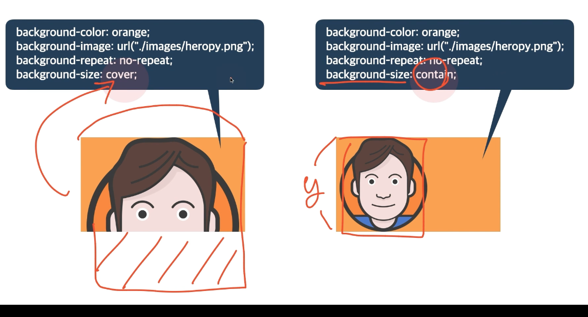

## 배치

    position : 요소의 위치 지정 지준
        static(dafault) : 기준 없음 
            -> 기준이 없을 경우 자식요소의 absolute 설정 불가
        relative : 요소 자신을 기준
            -> position을 설정하기 전에 자신의 위치를 기준으로 한다.
        absolute : 위치 상 부모 요소를 기준
            -> absolute를 사용하기 위해서는 부모요소에 relative설정이 되어있어야한다.
            -> 같은 자식 요소들의 상호작용이 작동하지 않는다.(쌓임 순서)
        fixed : 브라우저를 기준
            -> absolute과 다르게 처음부터 브라우저를 기준으로 본다.
        sticky : 스크롤 영역 기준

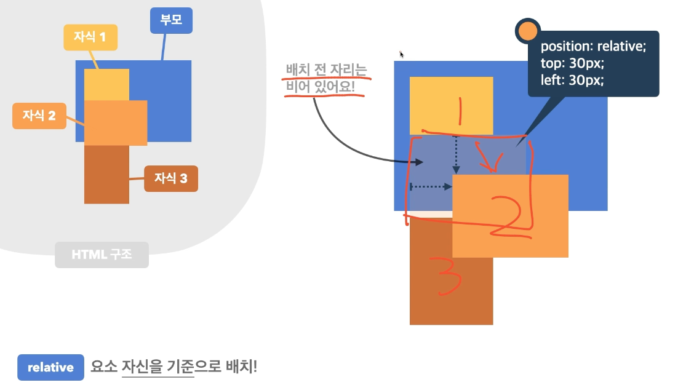
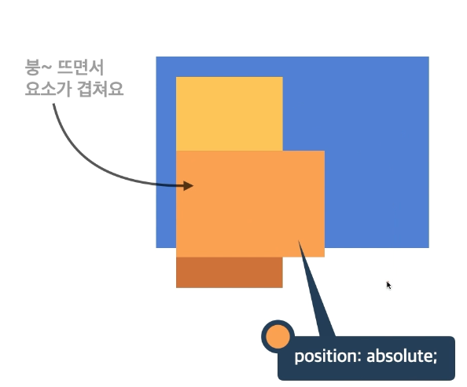
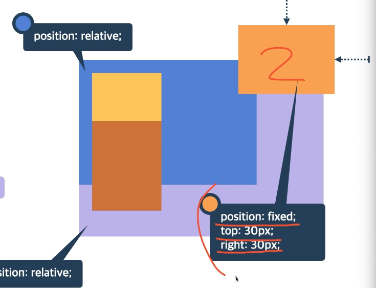

    요소 쌓임 순서 (Stack order)
        어떤 요소가 사용자와 더 가깝게 있는지 결정
        1. 요소에 position속성의 값이 있는 경우 위에 쌓임(static일경우 아래로 쌓임)
        2. 1번 조건이 같은 경우,z-index속성의 숫자 값이 높을 수록 위에 쌓음
        3. 1번과 2번 조건까지 같은 경우, html의 다음 구조일 수록 위에 쌓임

    z-index 
        요소의 쌓임 정도를 지정
        auto(default) : 부모 요소와 동일한 쌓임 정도
        숫자 :숫자가 높을 수록 위에 쌓임

    요소의 display가 변경됨
        position속성의 값으로 abosolute, fixed가 지정된 요소는
        display속성이 block으로 변경됨

## 플렉스(정렬) Container

    정렬을 할때는 보통 부모 요소에 작성한다.
    
    display : 수평을 하고자하는 요소의 부모 요소의 display를 flex로 설정한다.
        flex (수평정렬) : 블록 요소와 같이 flex Container 정의
        inline-flex (수평정렬) : 인라인 요소와 같이 flex Container 정의
        
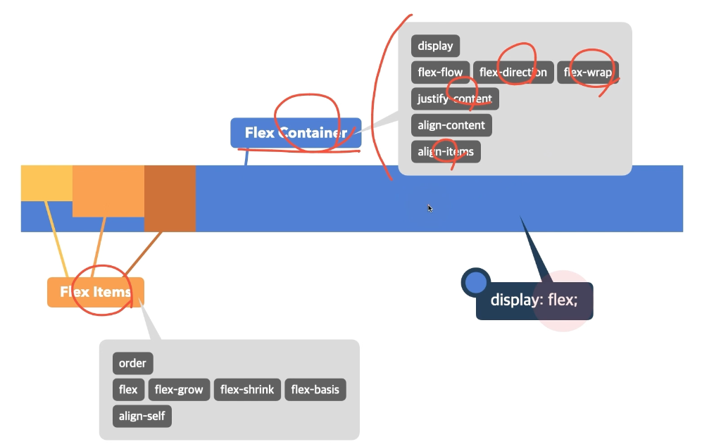
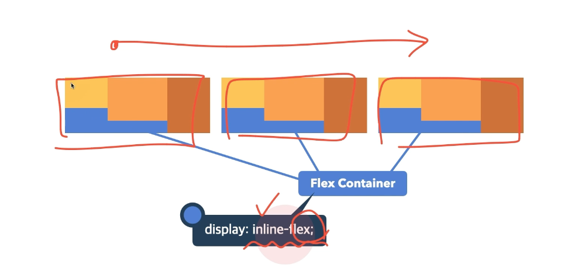

    flex-direction : 주 축을 설정(수평,수직 설정 결정)
        row : 행 축 (좌=>우)
        row-reverse : 행 축 (우 => 좌)
        column : 열 축 (좌 => 우)
        column-reverse : 열 축 (우 => 좌)

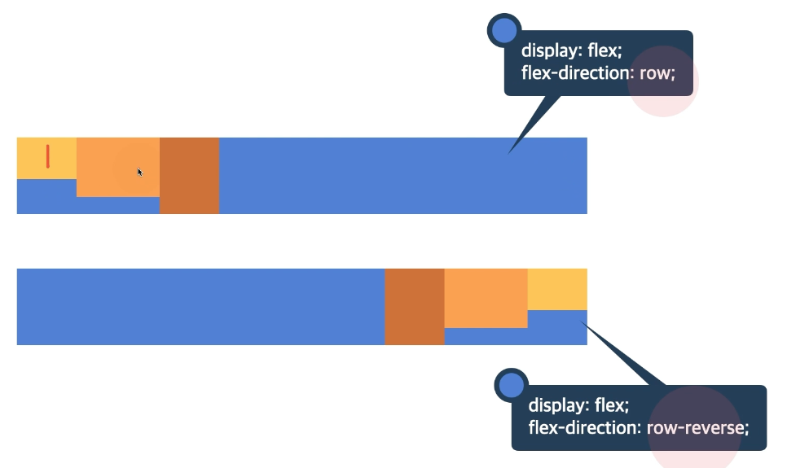
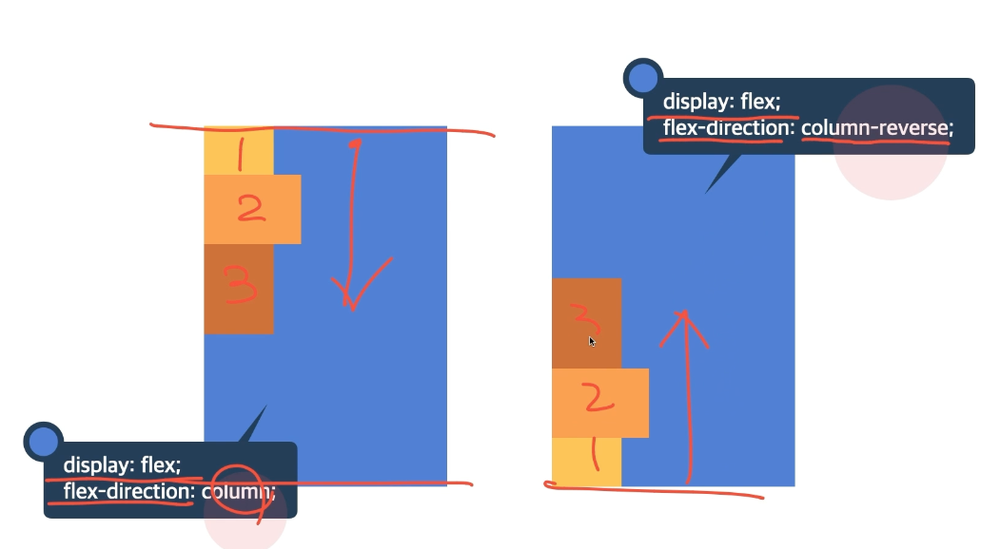

    flex-wrap : flex items 줄 바꿈 여부
        nowrap (default) : 줄바꿈 없음
        wrap : 줄바꿈

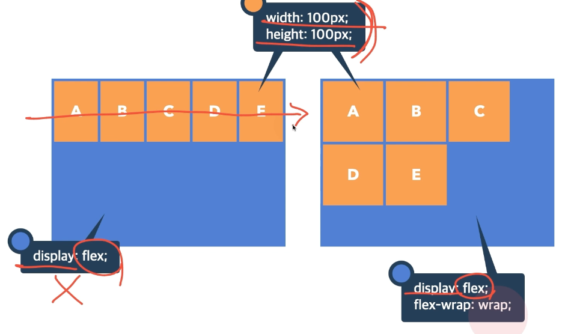

    justyfy-content : 주 축의 정렬 방법 (수평,flex-direction으로 인해 주 축의 위치가 변할수 있다.)
        flex-start : flex items를 시작점으로 정렬
        flex-end : flex items를 끝점으로 정렬
        center : flex items를 가운데 정렬

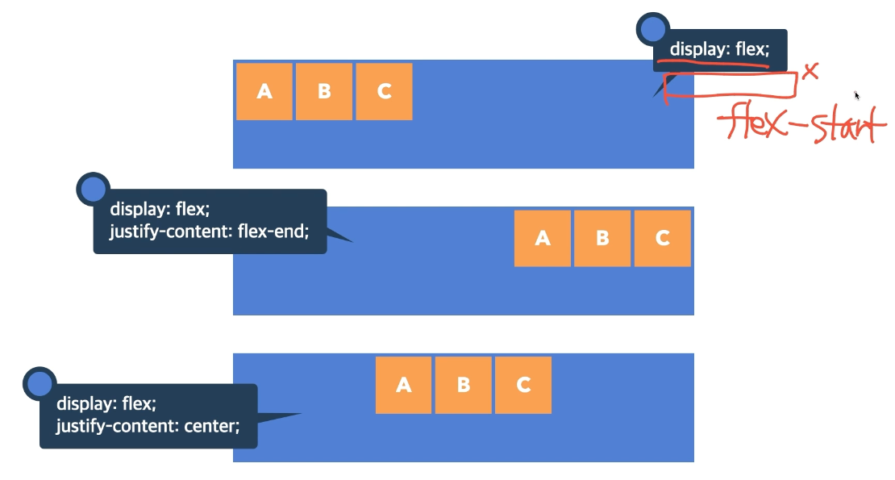

    align-content : 교차 축의 여러 줄 정렬 방법(수직)
        -> 2줄 이상이며, flex-wrap은 wrap으로 설정이 되어있어야한다.

        stretch(default) :flex items를 시작점으로 정렬
        flex-start : flex items를 시작점으로 정렬
        flex-end : flex items를 끝점으로 정렬
        center : flex items를 가운데 정렬

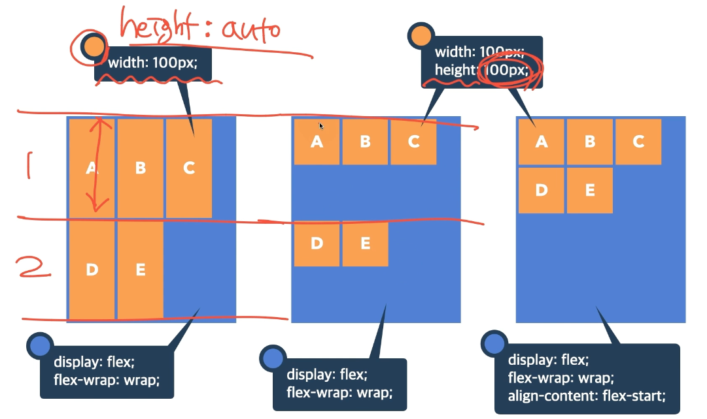

    align-items : 교차 축의 한 줄 정렬 방법
        -> 한줄일 경우 사용 여러줄이면 align-content사용해야한다.

        stretch(default) :flex items를 시작점으로 정렬
        flex-start : flex items를 시작점으로 정렬
        flex-end : flex items를 끝점으로 정렬
        center : flex items를 가운데 정렬

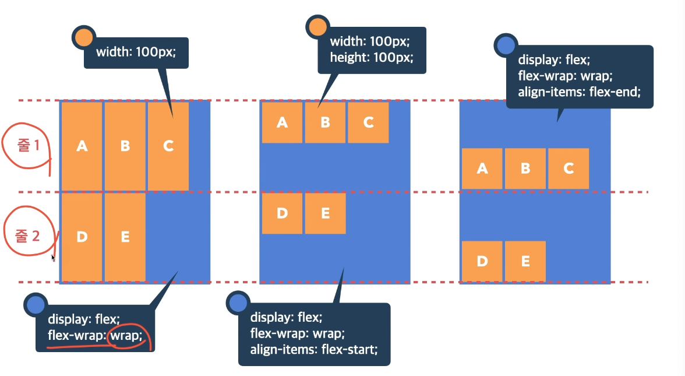

    order : flex item의 순서를 변경한다.
    0 (default) : 순서 없음
    숫자 : 숫자가 작을 수록 먼저

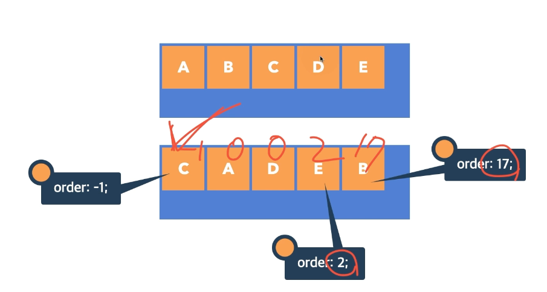

    flex-grow : flex item 증가 너비 비율
    0 (default) : 순서 없음
    숫자 : 증가 비율

    flex-shrink : flex item 감소 너비 비율
    1 (default) : 감소 없음
    숫자 : 감소 비율

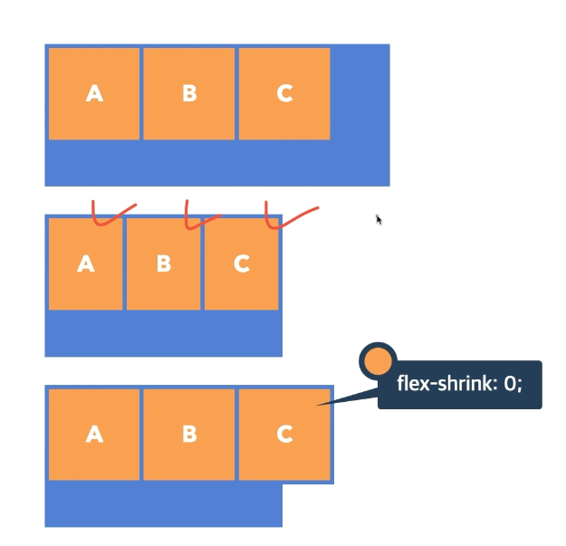
    
    flex-basis : flex item 공간 배분 전 기본너비

    

## 전환

## 변환

## 예제

